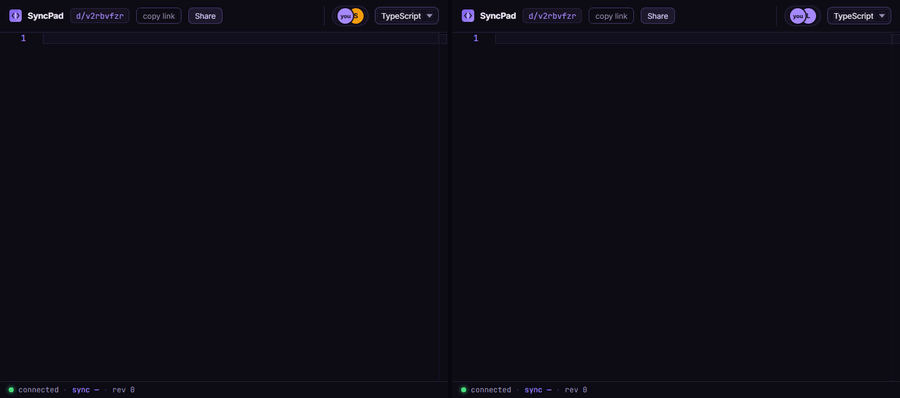
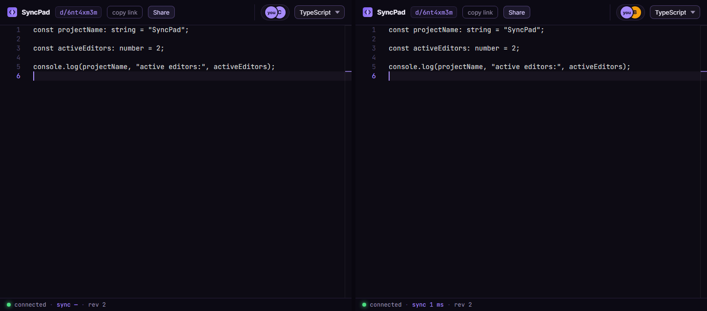
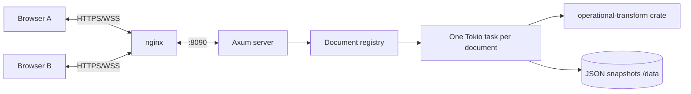

# SyncPad

[](https://github.com/ayenisholah/SyncPad/actions/workflows/ci.yml)
[](https://github.com/ayenisholah/SyncPad/actions/workflows/container-image.yml)

Real-time collaborative code editing with Rust, WebSockets, Monaco, and
operational transforms. [Open the production demo](https://syncpad.sholaayeni.xyz),
create a document, and share its link—no account required.





## Status

SyncPad is a deployed **production demo / pre-1.0 project**. Its synchronization,
persistence, test, image, deployment, and measurement paths are implemented and
operational. The open, ephemeral design is intentional; it is not a claim of
durable storage, private access, or general production readiness.

| Capability | Current behavior |
|---|---|
| Collaborative editing | Server-authoritative OT; one in-flight client op plus buffer |
| Presence and cursors | Server-assigned identity, live roster, transformed cursors/selections |
| Language | Shared allowlisted Monaco language selection |
| Sharing | Link copy and share/export panel |
| Persistence | Atomic JSON snapshots; 30 s default; lazy restart hydration |
| Lifecycle | Documents expire after 24 h idle by default |
| Limits | 64 KiB messages, 100 ops/s/connection, 10 live docs/IP |
| Deployment | Single container and single application instance behind nginx/TLS |
| Measurements | ≥200 sessions / 400 clients / 400 acknowledged ops/s; public p50 349 ms, p95 1,434 ms |

## Quick start

Requirements: stable Rust with `rustfmt`/`clippy`, Node.js 22+, npm, and Bash
(or PowerShell on Windows).

```sh
git clone https://github.com/ayenisholah/SyncPad.git
cd SyncPad
./scripts/setup.sh
cargo run -p syncpad-server
```

In another terminal:

```sh
cd web
npm run dev
```

Vite proxies `/api` and `/ws` to the Rust server on port 8090. Open the URL it
prints. Windows setup is `powershell -ExecutionPolicy Bypass -File
scripts\setup.ps1`.

Run the full local gate:

```sh
bash scripts/verify.sh
# Windows: powershell -ExecutionPolicy Bypass -File scripts\verify.ps1
```

Focused checks:

```sh
cargo test --workspace
SYNCPAD_FUZZ_SEEDS=500 SYNCPAD_FUZZ_ROUNDS=400 cargo test -p syncpad-server --test fuzz_convergence
cd web && npm run test:unit
npx playwright install chromium && npm run test:e2e
npm run docs:check
```

## Production container

Build locally, then mount `/data` and publish port 8090:

```sh
docker build -t syncpad:local .
docker run --rm -p 8090:8090 -v syncpad-data:/data \
  -e PORT=8090 -e SYNCPAD_DATA_DIR=/data -e SYNCPAD_STATIC_DIR=/app/web/dist \
  syncpad:local
```

The published image can be deployed with Compose:

```sh
SYNCPAD_IMAGE=ghcr.io/ayenisholah/syncpad:edge \
  docker compose -f deploy/docker-compose.yml up -d
```

See the [deployment and operations guide](deploy/README.md) for TLS, secrets,
smoke tests, logs, rollback, recovery, and GHCR workflow details.

## Architecture



[View the rendered architecture](docs/architecture.png) or read the full
[architecture guide](docs/architecture.md).

Each local edit becomes an operation. The client permits one operation in
flight and buffers later edits. The document task transforms the operation
against revisions it has not seen, applies it, then sends an ack to the author
and the transformed operation to peers. Remote operations are transformed
against pending local work and applied under an echo guard. Invalid or lagged
state triggers a fresh `init` resync.

SyncPad chooses centralized OT because a central server already owns each room,
the revision order is explicit, and document state stays compact. A CRDT is a
better fit for offline-first or peer-to-peer merging, which SyncPad does not
offer. Transform and apply algebra comes from the tested
[`operational-transform`](https://crates.io/crates/operational-transform) crate;
SyncPad implements the surrounding protocol, state machine, cursor mapping, and
recovery rather than hand-rolling the algebra.

## Measured results

The measured lower bound on the production VPS is **200 simultaneous sessions,
400 WebSocket clients, and 400 acknowledged operations/s**, with no convergence
failures in the recorded ramp. Three public HTTPS/WSS runs produced median
remote-apply latency of **p50 349 ms and p95 1,434 ms**, missing the original
latency target. These are observations from one environment, not a capacity
ceiling or SLA. Read the full [methodology and artifacts](docs/measurements.md).

To inspect harness options or run an authorized local measurement:

```sh
cd web
npm run measure -- --help
npm run measure -- --origin http://127.0.0.1:8090 --start-sessions 1 \
  --step-sessions 1 --max-sessions 1 --hold-seconds 10
```

Production runs use the manual **Measure Production** workflow and preserve
public-path and VPS-loopback artifacts.

## Security model and limitations

The document slug is a bearer capability: anyone with the link can read and
edit. There is no authentication, authorization, document enumeration API,
encryption at rest, database, version history, collaborative undo, or
offline-first merge. Snapshots can lose up to one interval on abrupt failure
and expire with idle documents. The UI is desktop-oriented and Monaco/fonts
currently depend on external network resources.

The server trusts proxy forwarding headers because the supported deployment
binds it to host loopback behind nginx. Operate exactly one app instance;
horizontal scaling is unsupported. Review [SECURITY.md](SECURITY.md) before
exposing a deployment.

## Repository map

| Path | Purpose |
|---|---|
| `server/` | Rust HTTP/WebSocket server, document tasks, snapshots, tests |
| `web/` | React/Monaco frontend, client OT, Playwright, docs tooling |
| `docs/` | Architecture, specification, ADRs, and measurements |
| `deploy/` | Compose/nginx production bundle and operations guide |
| `.github/workflows/` | CI, image publishing, deployment, measurement |
| `scripts/` | Setup, verification, and load harness entry points |

## Documentation

Start at the [documentation index](docs/README.md). Contributor workflow and
the complete test matrix are in [CONTRIBUTING.md](CONTRIBUTING.md); deployment
is in [deploy/README.md](deploy/README.md). The engineering specification and
ADRs remain authoritative for requirements and design decisions.

## Contributing

Read [CONTRIBUTING.md](CONTRIBUTING.md) before opening a change. Significant
protocol, dependency, or architecture changes require a proposed ADR.

## License

[MIT](LICENSE) © 2026 Shola Ayeni
