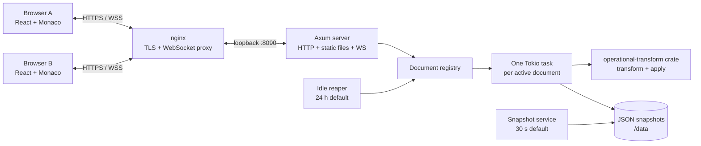

# Architecture

SyncPad is one Rust process serving a React application, an HTTP creation API,
and a WebSocket collaboration protocol. It deliberately runs as one instance:
documents are authoritative in memory and are not distributed between servers.

[Rendered PNG](architecture.png)

## Responsibilities

- React owns routing, sharing UI, presence display, language selection, latency
  display, and the client OT state machine. Monaco provides editing.
- Axum serves `POST /api/docs`, `/ws/{docId}`, and the built SPA.
- The registry creates or lazily hydrates document tasks. Each task exclusively
  owns its content, revision log, language, participants, and cursor state.
- The `operational-transform` Rust crate supplies transform/apply algebra.
  SyncPad owns revision ordering, validation, acks, broadcasts, cursor
  transformation, and resynchronization; the algebra is not hand-written.
- The snapshot service atomically writes dirty documents. The reaper expires
  idle in-memory documents and stale snapshot files.

## Operation lifecycle and client state

The client is `Synchronized`, `AwaitingConfirm`, or `AwaitingWithBuffer`. A
local Monaco edit becomes an OT operation. At most one operation is in flight;
additional edits compose into a buffer. The server transforms an operation
from its `baseRevision` through the newer revision log, applies it, advances
the revision, acknowledges the author, and broadcasts the transformed operation
to peers. An ack sends the buffer, if any. A remote operation is transformed
against in-flight/buffered local work before Monaco applies it under an echo
guard.

Malformed, too-old, or unrecoverable state produces `resync`. Broadcast lag also
forces resync. The browser discards speculative protocol state, reconnects, and
accepts a fresh `init` snapshot. Reconnect does not provide offline-first merge
or replay: unsent edits can be lost.

## Protocol and data flow

Creating a document returns an unguessable eight-character slug. Opening
`/d/{slug}` connects to `/ws/{slug}` and receives `init` with content, revision,
language, roster, and the caller's participant ID. Client messages are `op`,
`cursor`, `setLanguage`, and `ping`; server messages are `init`, `op`, `ack`,
`cursor`, `presence`, `language`, `pong`, and `resync`. See the
[engineering specification](syncpad-engineering-doc.md) and codec definitions
in `server/src/protocol.rs` for exact fields.

## Persistence and lifecycle

Documents live in memory, with dirty snapshots written as per-document JSON
files every 30 seconds by default and again during graceful shutdown. Files are
written through a temporary file and rename. A document absent from memory is
hydrated lazily from its snapshot. The default idle TTL is 24 hours; the reaper
removes expired tasks and snapshots. This is restart persistence, not durable
database storage or backup history. A crash can lose changes since the last
snapshot.

## Limits and trust boundary

The fixed safeguards are 64 KiB per WebSocket message, 100 operations per
second per connection (burst 100), and 10 distinct simultaneously open
documents per client IP. nginx must overwrite forwarding headers because the
app trusts `X-Real-IP`/`X-Forwarded-For` behind loopback. Slug possession grants
edit access; there are no accounts, ACLs, encryption at rest, or enumeration
API. See [SECURITY.md](../SECURITY.md).

## Scaling constraint

Run exactly one application instance. Horizontal replicas would split a
document's authority and diverge unless document affinity plus shared
coordination were added. The verified result is a lower bound of 200 sessions,
400 clients, and 400 acknowledged operations/s on the measured VPS, not a
promise beyond that environment. See [measurements](measurements.md).
